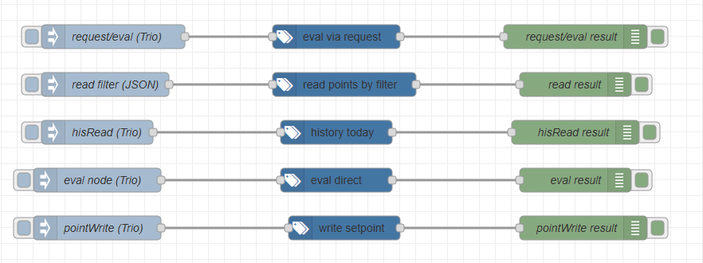

#  node-red-contrib-haystack

Node-RED nodes for working with Project Haystack servers.

This package lets Node-RED authenticate with Haystack-compatible servers and call common Haystack HTTP API operations such as `read`, `hisRead`, `eval`, and `pointWrite`.

Supported server platforms include Haxall, FIN, SkySpark, and other Project Haystack-compatible systems.

## Install

Install from the Node-RED editor:

1. Open **Manage palette**
2. Go to **Install**
3. Search for `node-red-contrib-haystack`
4. Click **Install**

Or install from the command line in your Node-RED user directory, usually `~/.node-red`:

```bash
npm install node-red-contrib-haystack
```

Restart Node-RED after installation if required.

## Nodes

This package provides the following nodes:

| Node                   | Description                                                                       |
| ---------------------- | --------------------------------------------------------------------------------- |
| `haystack-server`      | Configuration node for server URL, project path, credentials, and token caching.  |
| `haystack-request`     | Generic Haystack HTTP operation node. Use this for common or custom Haystack ops. |
| `haystack-read`        | Convenience node for the `read` operation.                                        |
| `haystack-hisread`     | Convenience node for the `hisRead` operation.                                     |
| `haystack-eval`        | Convenience node for the `eval` operation.                                        |
| `haystack-point-write` | Convenience node for the `pointWrite` operation.                                  |

## Quick start

1. Add one of the Haystack nodes, for example `haystack-read` or `haystack-eval`.
2. Open the node configuration.
3. Create a new `haystack-server` config node from the server field.
4. Configure the connection settings.
5. Deploy the flow.

Example configuration:

```text
Base URL:    http://haystackServer:8080
Project Path: /api/myProjectName
```

The first request authenticates automatically. The authentication token is cached and reused by the runtime.

## Example flow

An example flow is included in the repository:

```text
examples/demo-flow.json
```

Example flow preview:



After importing the flow, replace the placeholder refs with refs from your own Haystack server:

```text
@POINT_REF
@EQUIP_REF
@WRITABLE_POINT_REF
```

Credentials are not included in the example flow. Configure them in the `haystack-server` config node after import.

## Configuration

### `haystack-server`

The `haystack-server` node stores the shared connection settings used by the other Haystack nodes.

| Field        | Description                                                                                              |
| ------------ | -------------------------------------------------------------------------------------------------------- |
| Base URL     | Server root URL or hostname, for example `http://haystackServer:8080` or `https://haystack.example.com`. |
| Project Path | Haystack HTTP API path, usually `/api/{projectName}`.                                                    |
| Username     | Username used for Haystack authentication.                                                               |
| Password     | Password used for Haystack authentication.                                                               |

Tip: for Haxall, the default project is commonly named `sys`.

## Usage

Most nodes can be configured in the editor or controlled dynamically using `msg.haystack`.

The preferred message format is:

```json
{
  "haystack": {
    "op": "eval",
    "expr": "readAll(point).limit(5)"
  }
}
```

Older flat message fields are still accepted in some places for compatibility, but new flows should use `msg.haystack`.

## Node details

### `haystack-request`

Generic node for calling Haystack HTTP API operations.

Supports common and custom Haystack ops using `msg.haystack.op`.

Common message fields:

```text
msg.haystack.op
msg.haystack.format
msg.haystack.outputMode
msg.headers
msg.payload
msg.rawBody
```

Returns:

```text
msg.payload
msg.statusCode
msg.headers
```

### `haystack-eval`

Convenience node for the `eval` operation.

### `haystack-read`

Convenience node for the `read` operation.

Supports reads by filter or record id.

### `haystack-hisread`

Convenience node for the `hisRead` operation.

Supports single-point history reads.

### `haystack-point-write`

Convenience node for the `pointWrite` operation.

Supported actions:

```text
write
manualAuto
emergencyAuto
```

Supported result modes:

```text
array
ack
```

## Formats

The nodes support these Project Haystack wire formats:

| Format | Description                                    |
| ------ | ---------------------------------------------- |
| Zinc   | Default format for generated request bodies.   |
| JSON   | Can be returned as a parsed JavaScript object. |
| Trio   | Returned as a UTF-8 string.                    |

## Compatibility

This package is designed for platforms implementing the Project Haystack HTTP API and related Haystack protocols.

Compatible platforms include:

* Haxall
* FIN Framework
* SkySpark
* Niagara with the nHaystack driver
* other Project Haystack-compatible platforms

The nodes support Zinc, JSON, and Trio Haystack wire formats.

## References

* [Project Haystack](https://project-haystack.org/)
* [Haxall](https://haxall.io/)
* [nHaystack Driver](https://github.com/ci-richard-mcelhinney/nhaystack)

## License

MIT
